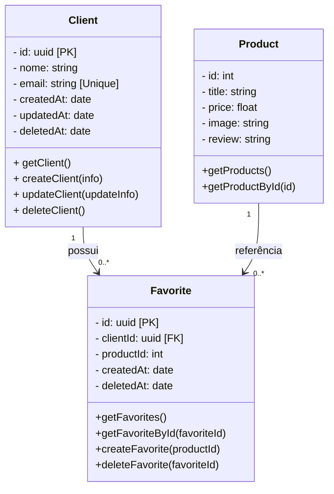

# Desafio Técnico AiqFome
## Introdução
### Motivações

### Dicionário de Expressões

### Escopo geral e considerações

## Justificativa de escolhas
### Desenvolvimento
#### Linguagem: `Typescript`
Optei pelo `TypeScript` por oferecer tipagem estática robusta, o que aumenta a confiabilidade e reduz erros comuns em tempo de execução. Além disso, o ecossistema voltado a desenvolvimento de APIs (com frameworks como `NestJS` e Express) favorece a criação de soluções escaláveis, seguras e bem estruturadas, alinhadas com os requisitos do desafio.

Os recursos de decorators, middlewares e validações fortemente tipadas tornam o desenvolvimento mais ágil sem abrir mão da clareza e manutenibilidade do código. Embora alternativas como `FastAPI` com Python também fossem possíveis, o `TypeScript` foi escolhido por estar mais alinhado ao meu fluxo de trabalho e por oferecer uma arquitetura mais adequada para evoluir a aplicação em escala.

#### Framework: ``NestJS``
Embora o `ExpressJS` seja mais leve e rápido de configurar, o `NestJS` se destaca neste projeto por oferecer uma arquitetura opinada e recursos nativos que favorecem a escalabilidade e a manutenção. O suporte integrado a documentação `Swagger`, validações `class-validator` e injeção de dependências tornam a API mais robusta e fácil de evoluir. Considerando ainda que este sistema pode futuramente compor um ambiente de microsserviços, a modularidade nativa do `NestJS` será importante.

Além disso, minha familiaridade com o `NestJS` acelera o desenvolvimento sem comprometer a qualidade do código. Reconheço que sua curva de aprendizado pode ser um obstáculo em alguns contextos, mas para este desafio, os benefícios superam a complexidade inicial.

#### Gerenciador de Pacotes: `pnpm`
O `pnpm` foi escolhido por oferecer uma gestão mais eficiente de dependências em comparação ao `npm` ou yarn. Diferente do `npm`, que duplica pacotes em cada projeto e pode gerar pastas node_modules gigantes, o `pnpm` utiliza um repositório global compartilhado, criando links simbólicos para cada projeto.

Desta forma, reduzimos drasticamente o uso de espaço em disco, melhora a performance na instalação e evita redundâncias. Para um projeto que pode crescer em módulos e integrações, essa eficiência no gerenciamento de dependências é um diferencial importante.

#### ORM (Mapeamento de banco de dados): `TypeORM`
Para o mapeamento do banco de dados, optei pelo TypeORM com abordagem code-first. Ele oferece suporte a decorators prontos, como `CreateDateColumn`, `UpdateDateColumn` e `DeleteDateColumn`, facilitando a criação automática de colunas de auditoria e reduzindo a necessidade de escrever SQL manualmente.

Além disso, o TypeORM fornece repositories e query builders que permitem um acesso consistente e tipado aos dados, aumentando a produtividade e mantendo a clareza do código. Essa abordagem torna a manutenção mais simples e garante uma integração fluida com o `NestJS`, respeitando boas práticas de arquitetura e escalabilidade.

#### Testes: `Jest`
O Jest é nativo do NestJS, ele é integrado, oferece suporte completo a testes unitários e de integração, mocks e cobertura de código, além de ser altamente performático e de fácil configuração. O Jest permite aproveitar recursos nativos do NestJS, como injeção de dependências e módulos de teste `(Test.createTestingModule)`, tornando o processo de criação e execução de testes mais simples e consistente.

Outras ferramentas, como `Mocha` ou `Jasmine`, poderiam ser utilizadas, mas exigiriam configuração manual adicional e integração com o `NestJS`, o que aumenta a complexidade sem oferecer benefícios significativos para este projeto. Dessa forma, o Jest se mostra a escolha mais prática, produtiva e alinhada ao ecossistema do framework.

### Infraestrutura

#### Banco de Dados: `postgres`
O PostgreSQL foi escolhido não apenas por ser o preferencial do desafio, mas também por suas vantagens técnicas sobre alternativas como `MongoDB` e `MySQL`. Em relação a bancos NoSQL como o `MongoDB`, ele oferece suporte a transações `ACID`, garantindo consistência e confiabilidade dos dados, o que é fundamental para que os produtos favoritos de um cliente estejam sempre corretos.

Comparado ao `MySQL`, o PostgreSQL suporta tipos avançados como `JSONB`, arrays e enums, possui excelente capacidade de otimização de consultas e é amplamente adotado em ambientes de alta escalabilidade. Essa combinação de maturidade, flexibilidade e performance o torna a escolha ideal para este projeto.

#### Docker: `Banco de dados`
O uso do Docker para o banco de dados garante um ambiente isolado, reproduzível e consistente, evitando conflitos de dependências com o sistema local. Isso facilita o desenvolvimento e os testes e garante que a API vai funcionar da mesma forma em diferentes ambientes. Em um cenário de produção, a solução poderia ser facilmente adaptada para um serviço de banco de dados em nuvem, como o AWS RDS, por exemplo, sem grandes alterações na aplicação.

#### Documentação: `Swagger`
O `Swagger` foi escolhido por sua integração nativa com o `NestJS`, permitindo que as rotas da API sejam identificadas e descritas de forma automática e padronizada. Além disso, gera uma página de documentação clara e interativa, facilitando o entendimento e a utilização da API por outros desenvolvedores ou sistemas que precisarão integrá-la. Essa abordagem aumenta a transparência, a manutenibilidade e a eficiência na comunicação entre equipes e sistemas.

#### CI/CD: `Github Actions`

## Planejamento
### DER (Diagrama Entidade e Relacionamento)
Foi utilizado `mermaid` para que fique mais bonito e legível do que um documento de imagem.

### Cuidados de Segurança
#### JWT

#### LeftHook

#### Rate-LImit

---
> A escrever.