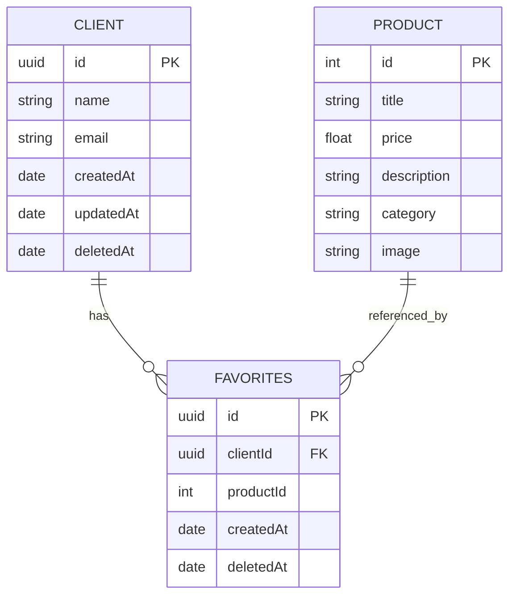
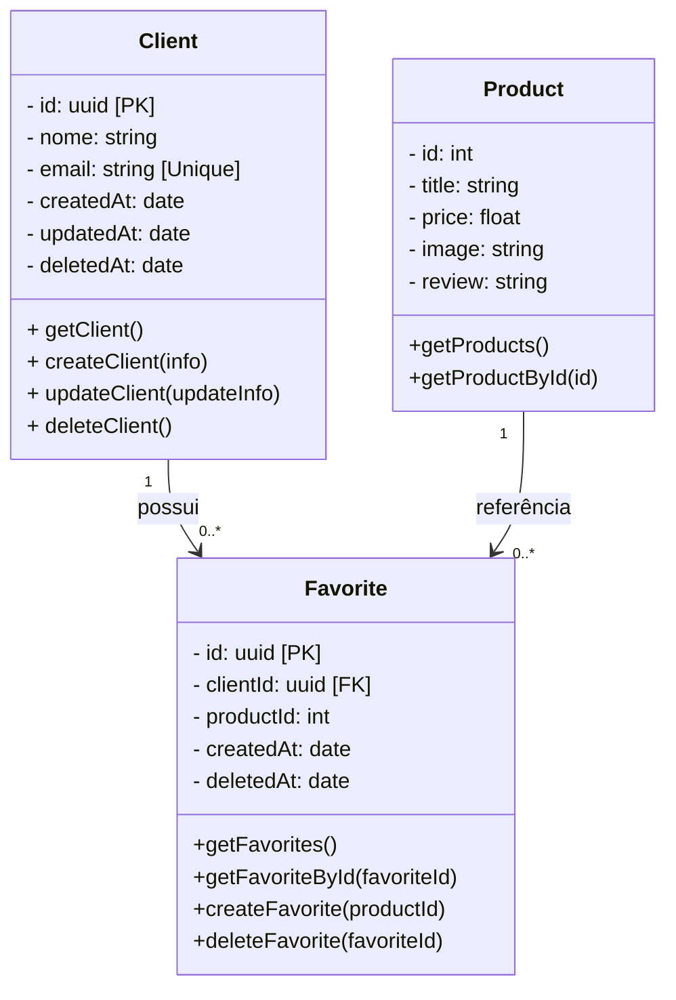

# Desafio Técnico AiqFome
---

## Sumário
- [Introdução](#introdução)
  - [Motivações](#motivações)
  - [Escopo geral e considerações](#escopo-geral-e-considerações)
  - [Dicionário de Expressões](#dicionário-de-expressões)
- [Justificativa de escolhas](#justificativa-de-escolhas)
  - [Desenvolvimento](#desenvolvimento)
    - [Linguagem: Typescript](#linguagem-typescript)
    - [Framework: NestJS](#framework-nestjs)
    - [Gerenciador de Pacotes: pnpm](#gerenciador-de-pacotes-pnpm)
    - [ORM: TypeORM](#orm-mapeamento-de-banco-de-dados-typeorm)
    - [Testes: Jest](#testes-jest)
  - [Infraestrutura](#infraestrutura)
    - [Banco de Dados: Postgres](#banco-de-dados-postgres)
    - [Docker: Banco de dados](#docker-banco-de-dados)
    - [Documentação: Swagger](#documentação-swagger)
    - [CI/CD: Github Actions](#cicd-github-actions)
- [Planejamento](#planejamento)
  - [Diagramas](#diagramas)
    - [DER (Diagrama Entidade e Relacionamento)](#der-diagrama-entidade-e-relacionamento)
    - [Diagrama de classes](#diagrama-de-classes)
  - [Cuidados de Segurança](#cuidados-de-segurança)
    - [JWT](#jwt)
    - [LeftHook](#lefthook)
    - [Rate-Limit](#rate-limit)

---
## Introdução
*Esta documentação será propositalmente mais robusta do que o tempo sugerido para o desafio. Como na frase atribuída a Abraham Lincoln: 
`Se me derem 5 horas para cortar uma árvore, passarei 4 horas afiando meu machado`.*

Este projeto propõe uma arquitetura inspirada em um ambiente de **microsserviços**, mas com uma simplificação importante: a representação do usuário será feita diretamente em banco de dados. 

Em um cenário ainda mais próximo da realidade, a autenticação poderia ser descentralizada: o usuário seria validado a partir do **JWT** emitido por um serviço dedicado de clientes, e apenas após a verificação da procedência do token, as operações de favoritos seriam permitidas.

Neste desafio, para manter a simplicidade, incluímos também um **módulo de clientes**. Nele, o usuário poderá se registrar informando nome e e-mail, e receberá um e-mail contendo sua chave (**JWT**), que servirá para autenticar e alimentar o sistema de produtos favoritos.

### Motivações
- **Demonstrar competência técnica necessária**: Mostrar domínio de ferramentas modernas, boas práticas de arquitetura, padrões de projeto e metodologias ágeis, evidenciando capacidade de entregar soluções robustas, escaláveis e seguras, alinhadas às exigências de um ambiente de produção.

- **Construir uma API escalável e modular**: Ao usar NestJS, TypeScript e uma arquitetura modular, o objetivo é criar um sistema que seja fácil de manter e evoluir, simulando cenários de produção com múltiplos módulos e potenciais microsserviços.

- **Gerenciar dados críticos com segurança**: O gerenciamento de clientes e produtos favoritos envolve dados pessoais e transações consistentes. A motivação é aplicar conceitos de segurança, autenticação `(JWT)` e integridade de dados `(ACID)` em um projeto realista.

- **Explorar boas práticas de desenvolvimento**: Uso de testes unitários e de integração `(Jest)`, validação de dados, documentação `(Swagger)` e versionamento de API, promovendo qualidade de código e confiabilidade do sistema.

- **Simular funcionalidades reais de um produto**: Recursos como envio de e-mail, controle de favoritos, validação de produtos e rate-limit demonstram conhecimento prático em soluções que seriam aplicáveis em sistemas comerciais, como o AiqFome.

### Escopo geral e considerações

- A API terá como foco principal o **gerenciamento de clientes** e seus **produtos favoritos**, permitindo operações de criação, leitura, atualização e exclusão (CRUD) de clientes e favoritos.

- Os **produtos não serão armazenados localmente**, mas consumidos de uma API externa (`https://fakestoreapi.com`), garantindo dados atualizados e consistência com o catálogo real.

- Cada cliente terá **autenticação via JWT único** que será enviado por email. Este mesmo JWT será utilizado para rate-limit, ele permitirá que apenas usuários válidos acessem e modifiquem seus próprios favoritos, reforçando a segurança da aplicação.

- As operações de cliente serão feitas exclusivamente com base no id armazenado no token, ou seja, ele não poderá alterar qualquer outro de forma alguma.

- Serão aplicadas **validações rigorosas** nos dados de entrada, garantindo integridade e evitando duplicidades tanto de clientes quanto de produtos favoritos.

- A API será desenvolvida com foco em **escala e manutenção**, utilizando NestJS e TypeScript, arquitetura modular, documentação Swagger e boas práticas de DevOps.

- Considerações adicionais:
  - O envio de e-mails será feito via e-mail dedicado com `node-mailer`, permitindo integração futura com serviços reais de SMTP ou APIs como SendGrid.
  - `Rate-limit` será implementado para proteger endpoints críticos contra abusos ou picos de tráfego.
  - A aplicação poderá ser facilmente containerizada via Docker, permitindo reprodução consistente do ambiente de desenvolvimento e testes.

### Dicionário de Expressões
- **ACID** – Conjunto de propriedades (Atomicidade, Consistência, Isolamento e Durabilidade) que garantem a confiabilidade das transações em bancos de dados relacionais.
- **CRUD** – Acrônimo para Create, Read, Update, Delete. Representa as quatro operações básicas de persistência em um banco de dados.
- **ORM** – (Object-Relational Mapping) Técnica que permite mapear classes e objetos da aplicação para tabelas do banco de dados relacional, facilitando o acesso e manipulação de dados.
- **DTO** – (Data Transfer Object) Objeto usado para transportar dados entre camadas da aplicação, garantindo validação e tipagem consistentes.
- **Entity** – Representação de uma tabela no banco de dados dentro do ORM (no caso, TypeORM). Define os atributos e relacionamentos dos dados.
- **Repository** – Camada responsável por centralizar a lógica de acesso ao banco de dados, fornecendo métodos para manipulação das entidades.
- **Migration** – Arquivos versionados que descrevem alterações na estrutura do banco de dados (como criação de tabelas e colunas). Permitem manter o schema sincronizado entre ambientes.
- **Swagger (OpenAPI)** – Ferramenta para geração de documentação interativa de APIs REST, permitindo visualizar e testar endpoints de forma padronizada.
- **JWT** – (JSON Web Token) Padrão de token utilizado para autenticação e autorização, garantindo segurança e validade de sessões de usuários.
- **Rate Limit** – Técnica para limitar a quantidade de requisições que um cliente pode fazer em um intervalo de tempo, protegendo a API contra abusos e ataques.
- **CI/CD** – (Continuous Integration / Continuous Deployment) Práticas que automatizam o processo de integração de código, execução de testes e deploy em ambientes de produção.
- **Docker** – Plataforma de containers que permite empacotar aplicações e suas dependências de forma isolada e reproduzível em qualquer ambiente.
- **pnpm** – Gerenciador de pacotes JavaScript que utiliza armazenamento global com links simbólicos, economizando espaço em disco e acelerando instalações.
- **NestJS** – Framework Node.js progressivo, baseado em TypeScript, que fornece uma arquitetura modular e opinada para construção de APIs escaláveis.

---

## Justificativa de escolhas
### Desenvolvimento
#### Linguagem: `Typescript`
Optei pelo `TypeScript` por oferecer tipagem estática robusta, o que aumenta a confiabilidade e reduz erros comuns em tempo de execução. Além disso, o ecossistema voltado a desenvolvimento de APIs (com frameworks como `NestJS` e Express) favorece a criação de soluções escaláveis, seguras e bem estruturadas, alinhadas com os requisitos do desafio.

Os recursos de decorators, middlewares e validações fortemente tipadas tornam o desenvolvimento mais ágil sem abrir mão da clareza e manutenibilidade do código. Embora alternativas como `FastAPI` com Python também fossem possíveis, o `TypeScript` foi escolhido por estar mais alinhado ao meu fluxo de trabalho e por oferecer uma arquitetura mais adequada para evoluir a aplicação em escala.

#### Framework: ``NestJS``
Embora o `ExpressJS` seja mais leve e rápido de configurar, o `NestJS` se destaca neste projeto por oferecer uma arquitetura opinada e recursos nativos que favorecem a escalabilidade e a manutenção. O suporte integrado a documentação `Swagger`, validações `class-validator` e injeção de dependências tornam a API mais robusta e fácil de evoluir. Considerando ainda que este sistema pode futuramente compor um ambiente de microsserviços, a modularidade nativa do `NestJS` será importante.

Além disso, minha familiaridade com o `NestJS` acelera o desenvolvimento sem comprometer a qualidade do código. Reconheço que sua curva de aprendizado pode ser um obstáculo em alguns contextos, mas para este desafio, os benefícios superam a complexidade inicial.

#### Gerenciador de Pacotes: `pnpm`
O `pnpm` foi escolhido por oferecer uma gestão mais eficiente de dependências em comparação ao `npm` ou yarn. Diferente do `npm`, que duplica pacotes em cada projeto e pode gerar pastas node_modules gigantes, o `pnpm` utiliza um repositório global compartilhado, criando links simbólicos para cada projeto.

Desta forma, reduzimos drasticamente o uso de espaço em disco, melhora a performance na instalação e evita redundâncias. Para um projeto que pode crescer em módulos e integrações, essa eficiência no gerenciamento de dependências é um diferencial importante.

#### ORM (Mapeamento de banco de dados): `TypeORM`
Para o mapeamento do banco de dados, optei pelo TypeORM com abordagem code-first. Ele oferece suporte a decorators prontos, como `CreateDateColumn`, `UpdateDateColumn` e `DeleteDateColumn`, facilitando a criação automática de colunas de auditoria e reduzindo a necessidade de escrever SQL manualmente.

Além disso, o TypeORM fornece repositories e query builders que permitem um acesso consistente e tipado aos dados, aumentando a produtividade e mantendo a clareza do código. Essa abordagem torna a manutenção mais simples e garante uma integração fluida com o `NestJS`, respeitando boas práticas de arquitetura e escalabilidade.

#### Testes: `Jest`
O Jest é nativo do NestJS, ele é integrado, oferece suporte completo a testes unitários e de integração, mocks e cobertura de código, além de ser altamente performático e de fácil configuração. O Jest permite aproveitar recursos nativos do NestJS, como injeção de dependências e módulos de teste `(Test.createTestingModule)`, tornando o processo de criação e execução de testes mais simples e consistente.

Outras ferramentas, como `Mocha` ou `Jasmine`, poderiam ser utilizadas, mas exigiriam configuração manual adicional e integração com o `NestJS`, o que aumenta a complexidade sem oferecer benefícios significativos para este projeto. Dessa forma, o Jest se mostra a escolha mais prática, produtiva e alinhada ao ecossistema do framework.

### Infraestrutura

#### Banco de Dados: `postgres`
O PostgreSQL foi escolhido não apenas por ser o preferencial do desafio, mas também por suas vantagens técnicas sobre alternativas como `MongoDB` e `MySQL`. Em relação a bancos NoSQL como o `MongoDB`, ele oferece suporte a transações `ACID`, garantindo consistência e confiabilidade dos dados, o que é fundamental para que os produtos favoritos de um cliente estejam sempre corretos.

Comparado ao `MySQL`, o PostgreSQL suporta tipos avançados como `JSONB`, arrays e enums, possui excelente capacidade de otimização de consultas e é amplamente adotado em ambientes de alta escalabilidade. Essa combinação de maturidade, flexibilidade e performance o torna a escolha ideal para este projeto.

#### Docker: `Banco de dados`
O uso do Docker para o banco de dados garante um ambiente isolado, reproduzível e consistente, evitando conflitos de dependências com o sistema local. Isso facilita o desenvolvimento e os testes e garante que a API vai funcionar da mesma forma em diferentes ambientes. Em um cenário de produção, a solução poderia ser facilmente adaptada para um serviço de banco de dados em nuvem, como o AWS RDS, por exemplo, sem grandes alterações na aplicação.

#### Documentação: `Swagger`
O `Swagger` foi escolhido por sua integração nativa com o `NestJS`, permitindo que as rotas da API sejam identificadas e descritas de forma automática e padronizada. Além disso, gera uma página de documentação clara e interativa, facilitando o entendimento e a utilização da API por outros desenvolvedores ou sistemas que precisarão integrá-la. Essa abordagem aumenta a transparência, a manutenibilidade e a eficiência na comunicação entre equipes e sistemas.

#### CI/CD: `Github Actions`

---

## Planejamento
### Diagramas 
Foi utilizado `mermaid` para que fique mais bonito e legível do que um documento de imagem.

#### DER (Diagrama Entidade e Relacionamento)
**Lembrando que:** O Product não será armazenado no nosos banco de dados, ele será chamado por uma API externa, porém ele terá seu tipo referente e seu service específico.

#### Diagrama de classes

### Cuidados de Segurança

#### JWT
O sistema utiliza **JSON Web Tokens (JWT)** para autenticação e autorização. Cada cliente, ao se registrar, recebe um token que deve ser enviado em todas as requisições protegidas. O JWT garante que apenas usuários válidos possam acessar ou modificar seus próprios dados, evitando acesso não autorizado.

#### LeftHook
O **LeftHook** é um mecanismo de validação ou "hook" aplicado antes das operações críticas (como criação ou exclusão de favoritos). Ele permite verificar regras de negócio, validar permissões e interceptar requisições suspeitas, garantindo que apenas ações legítimas sejam executadas.

#### Rate-Limit
Para proteger a API contra abusos, picos de tráfego ou ataques de negação de serviço `(DoS)`, foi implementado um **rate-limit**. Este recurso limita a quantidade de requisições que um cliente pode fazer em um intervalo de tempo definido, preservando a estabilidade do sistema e garantindo qualidade de serviço para todos os usuários.

#### DTO + class-validator
O uso dos `DTOs` garante os atributos referidos para a rota, e o class-validator faz validações de tipo, tamanho, etc. previnindo ataques de XSS, SQL Injection, etc. Garantindo que apenas dados corretos e necessários cheguem a aplicação

---
## Preparando o ambiente

---
## Executando

> A escrever.